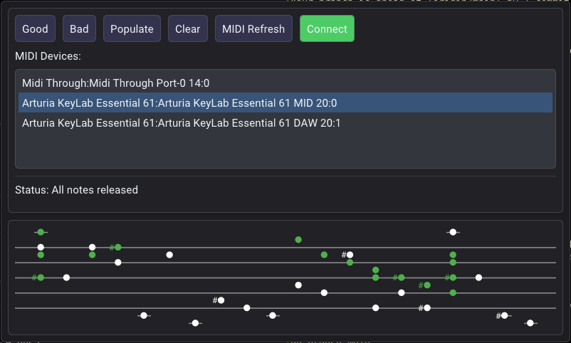

# Continuo Trainer

An interactive AI-based basso continuo trainer that analyzes your performance on
a MIDI keyboard against a displayed bassline, giving feedback on harmony,
rhythm, and style while adapting exercises through spaced repetition and
gamified learning; eventually envisioned as a compact standalone practice
device.

### Getting Started

Prerequisites: SDL2. (For static code analysis also need bear, clang-tidy,
clang-format, cppcheck, graphviz.)

To build, just clone project and call make, and then run the program:

    $ git clone git@github.com:js216/continuo_trainer.git
    $ cd continuo_trainer
    $ make -j4
    $ ./continuo_trainer

### The Story

I wondered how hard it would be to create a little AI system for practicing
continuo. The program would show a bassline and you have to realize it, and then
it would take the MIDI data to analyze if the realization was correct,
appropriate, and done with a good sense of rhythm. If not, it would present you
with more of similar examples, until the concept is learned. It could have some
spaced repetition scheme to ensure permanence. It could also play the melody
line to practice playing with other instruments. It would incorporate all the
latest findings about gamification, retention, hacking the brain rewards
pathways to make the process either fun or at least addictive enough to ensure
seamless learning. I imagine a proof of concept could be hacked together as a
simple Python script running a loop: show a note on a staff with a bass clef,
wait for MIDI input, check if it's a correct chord given the note (and maybe
some continuo figures), and then show the next note. This could be done in
levels, or stages, going through chapters similar to the Handel continuo
exercises. The chapters could be mixed up a little bit, adding the old material
into the mix with the new one, keeping scores of which figures, or which levels,
are the most difficult, just like Anki keeps scores for each flashcard. Then,
when one learns the basic figurations, the one note at a time approach would be
modified in showing a couple notes, or a couple bars, at a time, assuming the
user (or should we say player!) is able to realize individual chords fast
enough. Then, with the several notes or bars displayed, the program could also
teach some basic voice leading and judge the fluency, style, grace, or even
appropriateness to a particular national or temporal style. Finally, if the
software is proven to work and be fun enough to "play", the thing could be
packaged into a simple all-in-one plastic toy, with maybe one or two octaves of
a musical keyboard (doesn't need to be full scale), a simple display of the
bassline (could be just fixed LEDs arranged on a staff printed on Lexan), a
small speaker, and some input/output connections (maybe MIDI in/out, sound
in/out, and/or USB for either). Then, the whole thing would be placed on the
market only to realize there is no market for continuo-training toys ...

### Todo

- restore last used MIDI dev
- hide MIDI selection box when connected
- support for key signatures
- notes out of range displayed octave up/dn
- right half of status displays MIDI device
- read lessons from text files
- record times and all notes pressed to logs
- lessons can have a melody (different color)
- free-timing vs fixed rhythm mode
- melody playback via MIDI or audio
- display the clef symbol
- analyze lessons to generate new ones
- support for several lines of music
- voice leading analysis; hints displayed
- research gamification, motivation strategy
- remove as many of the clang-tidy exclusions as possible

### Author

Jakob Kastelic

## License

This project is licensed under the GNU General Public License v2.0 or later.
See the [LICENSE](LICENSE) file for details.
