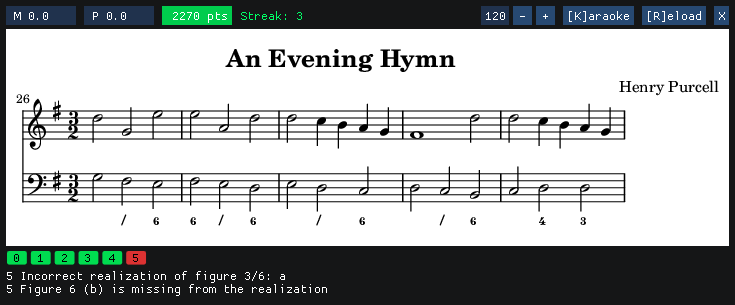

# Continuo Trainer

An interactive basso continuo trainer that analyzes your performance on a MIDI
keyboard against a displayed bassline, giving feedback on harmony, rhythm, and
style while adapting exercises through spaced repetition and gamified learning.

### Usage

First, make sure all chunks are up to date:

    cd continuo_trainer
    make index
    make all

Then, open the program and practice:

    bin/run src/play.dot

### Implementation

The app consists of a graph of tiny programs communicating mostly via their
standard input and output. (See `play.dot` for the graph.)

### Claude TODO

Select the first item from the following paragraphs and present a thorough
implementation plan, then confirm with me before implementing. When I give the
go ahead to implement, remove the paragaph from this file and prepare a commit
message for me to accept or reject. You are allowed to "read ahead" to prepare a
plan that will make sense in light of the future edits, but each edit show be
entirely self-contained and working and usable.

### Later potential features

"Journey" GUI: skill progression unlocking.

Unravel the play.dot graph so that the data flow is linear pipes as much as
possible rather than branching or loops.

Translate into Rust

Convert into reactor pattern (read about it)
